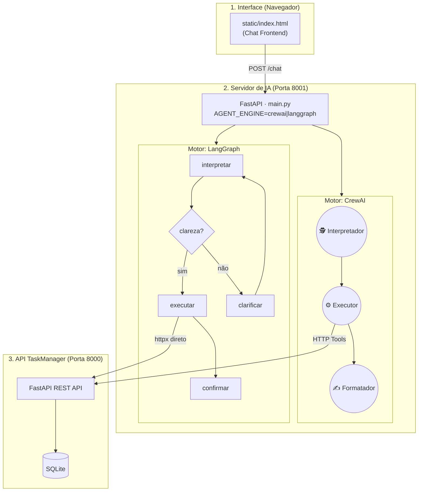

# TaskAgent V2 🤖

> Assistente inteligente de tarefas com **dois motores de IA intercambiáveis**: uma arquitetura multiagente com **CrewAI** e um grafo de estado determinístico com **LangGraph** — permitindo explorar e comparar na prática as principais abordagens de orquestração de agentes do mercado.

---

## 📌 O que é o Projeto?

O **TaskAgent V2** é um chatbot em linguagem natural conectado a uma API REST de gerenciamento de tarefas. Em vez de formulários, o usuário conversa livremente — e o sistema interpreta a intenção, executa a operação real na API e devolve uma resposta amigável.

### Funcionalidades

| Funcionalidade | Descrição |
|---|---|
| 💬 Chat Natural | Crie, liste, atualize e delete tarefas conversando |
| 🔀 Dois Motores | Alterne entre CrewAI e LangGraph via variável de ambiente |
| 🛠️ Tools Reais | Os agentes fazem chamadas HTTP reais — sem alucinações |
| 🧠 Memória Semântica | O CrewAI lembra de interações passadas via embeddings do Google |
| 🎨 Interface Web | Frontend *Dark Mode* servido pelo próprio FastAPI |

---

## ⚔️ Comparativo de Arquiteturas

Este repositório mantém **duas implementações completas** do mesmo assistente, cada uma usando uma filosofia de orquestração diferente. Este é o principal valor técnico do projeto para estudo e portfólio.

### Motor 1 — CrewAI (`crew/`) ⭐ Padrão Atual

Modelo baseado em **papéis e colaboração**. Cada agente é uma "pessoa" com personalidade, objetivo e ferramentas próprias.

```
Usuário → Interpretador de Intenções → Executor de Tasks → Formatador de Respostas → Usuário
```

| Característica | Detalhe |
|---|---|
| **Framework** | [CrewAI](https://www.crewai.com/) |
| **LLM** | Google Gemini (`gemini-3.1-flash-lite`) via API gratuita |
| **Embeddings** | `gemini-embedding-001` para memória semântica (ChromaDB/LanceDB) |
| **Memória** | ✅ Semântica nativa — lembra de sessões anteriores |
| **Autonomia** | Alta — o Executor decide qual Tool usar baseado em contexto |
| **Melhor para** | MVPs, assistentes pessoais, prototipagem rápida, NLU complexo |

**Arquivos principais:**
- [`crew/agents.py`](crew/agents.py) — Definição dos 3 agentes (Interpretador, Executor, Formatador)
- [`crew/tasks.py`](crew/tasks.py) — Tarefas sequenciais com output Pydantic validado
- [`crew/tools.py`](crew/tools.py) — Ferramentas HTTP que conectam o agente à API de tarefas
- [`crew/crew.py`](crew/crew.py) — Montagem do time e configuração de memória semântica

---

### Motor 2 — LangGraph (`graph/`) 🗺️ Legado / Estudo

Modelo baseado em **grafo de estado determinístico**. Você desenha exatamente quais caminhos o agente pode seguir — sem surpresas.

```
Usuário → [Interpretar] → {clareza?} → [Executar] → [Confirmar] → Usuário
                                 ↘ [Clarificar] ↗
```

| Característica | Detalhe |
|---|---|
| **Framework** | [LangGraph](https://langchain-ai.github.io/langgraph/) |
| **LLM** | Groq (`llama3-70b-8192`) — inferência ultrarrápida |
| **Embeddings** | ❌ Sem memória semântica entre sessões |
| **Memória** | Histórico manual em memória RAM (por sessão) |
| **Autonomia** | Baixa — cada transição de nó é codificada explicitamente |
| **Melhor para** | Produção crítica, auditoria, fluxos financeiros, observabilidade |

**Arquivos principais:**
- [`graph/state.py`](graph/state.py) — Estado global tipado (`TypedDict`) compartilhado entre os nós
- [`graph/graph.py`](graph/graph.py) — Construção do grafo, nós, bordas e bordas condicionais
- [`graph/nodes.py`](graph/nodes.py) — Implementação de cada nó (interpretar, clarificar, executar, confirmar)
- [`agent.py`](agent.py) — Função de entrada `executar_agente()` que invoca o grafo compilado

---

## 🏛️ Arquitetura do Ecossistema



---

## 🚀 Como Rodar Localmente

### Pré-requisitos

- Python 3.10+
- Gerenciador `uv` (recomendado) — ou `pip`
- **Para CrewAI:** Chave gratuita do [Google AI Studio](https://aistudio.google.com/)
- **Para LangGraph:** Chave gratuita do [Groq](https://groq.com/)

### 1. Configurar Variáveis de Ambiente

Copie o arquivo de exemplo e preencha suas chaves:

```bash
cp .env.example .env
```

```env
# Motor padrão (troque para "langgraph" para usar o motor legado)
AGENT_ENGINE=crewai

# Chave do Google Gemini (necessária para CrewAI)
GOOGLE_GEMINI_KEY="sua_chave_aqui"

# Chave do Groq (necessária para LangGraph)
GROQ_API_KEY="sua_chave_aqui"
```

### 2. Instalar Dependências

```bash
uv sync
```

### 3. Iniciar os Servidores

Abra **dois terminais**:

**Terminal 1 — API de Tarefas (porta 8000)**
```bash
cd TaskManager
uv run python -m uvicorn main:app --reload
```

**Terminal 2 — Servidor de IA (porta 8001)**
```bash
uv run uvicorn main:app --port 8001 --reload
```

### 4. Acessar o Chat

Abra: **[http://localhost:8001](http://localhost:8001)**

Exemplos de mensagens:
- *"Quais são minhas tarefas?"*
- *"Crie uma tarefa chamada Estudar LangGraph"*
- *"Marque a tarefa 5 como concluída"*
- *"Delete a tarefa de ID 3"*

> 💡 Para alternar o motor, mude `AGENT_ENGINE=langgraph` no `.env` e reinicie o servidor.

---

## 🛠️ Tecnologias

| Camada | Tecnologia |
|---|---|
| Backend / API | Python 3, FastAPI, httpx |
| Motor CrewAI | CrewAI, Google Gemini API, LanceDB |
| Motor LangGraph | LangGraph, LangChain, Groq (Llama 3) |
| Frontend | HTML5, CSS3, Vanilla JS, marked.js |
| Gerenciamento | `uv` (ambiente e dependências) |

---

## 📚 Documentação de Estudo

- 📓 **[Diário de Aprendizado](docs/LEARNING_DIARY.md)** — Histórico completo de decisões arquiteturais, erros encontrados e conceitos aprendidos ao longo do desenvolvimento (LangGraph, StateGraphs, CrewAI, embeddings, rate limits, etc.)
- 📝 **[Arquitetura Detalhada](docs/arquitetura.md)** — Diagramas técnicos das implementações

---

*Desenvolvido como projeto de estudo avançado em Orquestração de Agentes de IA — comparando abordagens determinísticas (LangGraph) e autônomas (CrewAI) na prática.*
