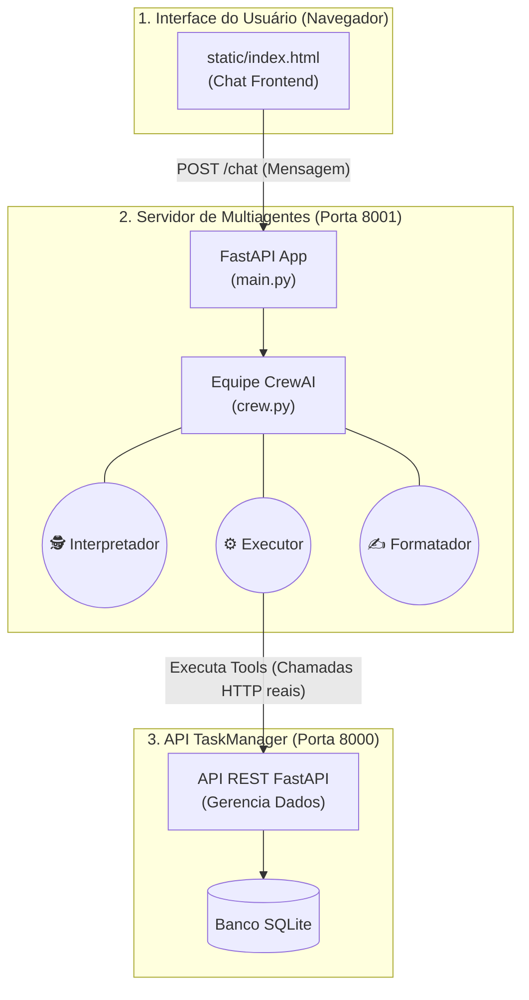

# TaskAgent V2 🤖🚀

Bem-vindo ao **TaskAgent V2**, um orquestrador inteligente de multiagentes desenvolvido em Python. 

Este projeto foi desenhado para ir além de chatbots tradicionais. Utilizando **CrewAI** e **LangGraph**, o sistema coordena múltiplos LLMs especializados (Agentes) que colaboram entre si para entender intenções complexas em linguagem natural e executar operações reais (via chamadas HTTP) em uma API RESTful de gerenciamento de tarefas.

O repositório reflete uma arquitetura moderna e pronta para produção, incluindo frontend *stateless* e integração segura de ferramentas (*tools*).

---

## 🎯 O que é o Projeto?

O TaskAgent V2 é um **Assistente Inteligente de Tarefas** que permite aos usuários gerenciar suas atividades do dia a dia através de um chat fluido. 

Ao invés de pedir para o usuário preencher formulários, o sistema interpreta o que ele diz, decide qual ação tomar, executa a requisição real no banco de dados e retorna uma resposta amigável. Por trás das cortinas, um time inteiro de agentes de IA divide o trabalho.

### Principais Funcionalidades
* 💬 **Chatbot Natural**: Criação, atualização, listagem e deleção de tarefas conversando livremente.
* 👥 **Orquestração Multiagentes (CrewAI)**: Uma equipe composta por um `Interpretador`, um `Executor` e um `Formatador` que raciocinam em cadeia (Cadeia de Pensamento).
* 🛠️ **Ferramentas HTTP Reais (Tools)**: Os agentes não "alucinam" ou inventam respostas; eles executam métodos GET/POST/PUT/DELETE de verdade na API.
* 🎨 **Painel Web Moderno**: Interface elegante (*Dark Mode*) construída puramente em HTML/CSS/JS e consumida através do FastAPI.

---

## 🛠️ Tecnologias Usadas

* **Backend / Orquestração**: Python 3, [FastAPI](https://fastapi.tiangolo.com/), [CrewAI](https://www.crewai.com/), Langchain
* **LLM / Inferência**: [Groq API](https://groq.com/) (Modelo Llama-3.3-70b-versatile) para execução ultrarrápida.
* **Cliente HTTP**: `httpx` para chamadas assíncronas de API.
* **Gerenciamento de Pacotes**: `uv` (extremamente ágil e isolado).
* **Frontend**: HTML5, CSS3, Vanilla JavaScript, Fetch API.

---

## 🏛️ Arquitetura do Sistema

O ecossistema foi projetado dividindo responsabilidades entre interface, orquestrador e persistência.



### Como o time funciona?
1. O **Interpretador de Intenções** analisa a frase e extrai IDs, nomes e status.
2. O **Executor de Tasks** recebe os dados e, usando suas `Tools` equipadas, aciona a rota certa da API na porta 8000.
3. O **Formatador de Respostas** recebe os dados brutos de sucesso/erro e formata um texto agradável ao usuário final.

---

## 🚀 Como Rodar Localmente

Siga o passo a passo abaixo para rodar o projeto inteiro no seu computador:

### Pré-requisitos
* Python 3.10+
* Gerenciador de pacotes `uv` (ou `pip` padrão).
* Chave de API do **Groq** (Grátis).

### 1. Configuração de Variáveis de Ambiente
Crie um arquivo `.env` na raiz do projeto (como referenciado no `.env.example`) contendo sua chave:
```env
GROQ_API_KEY="gsk_sua_chave_de_api_aqui"
```

### 2. Instalando as Dependências
Abra o terminal na pasta raiz do projeto e instale tudo via `uv`:
```bash
uv sync
```
*(Se não usar uv, pode rodar `pip install -r requirements.txt` ou instalar as bibliotecas `fastapi`, `uvicorn`, `crewai`, `langchain-groq`, `python-dotenv`, `httpx`)*

### 3. Rodando o Ambiente
Você precisará de **dois terminais**, pois simulamos um ecossistema com um backend externo e um servidor de IA.

**Terminal 1 (A API de Tarefas - Porta 8000)**
Entre na pasta da sua API de tarefas (TaskManager) e rode:
```bash
uv run uvicorn main:app --port 8000 --reload
```

**Terminal 2 (O Agente de IA - Porta 8001)**
Na raiz deste projeto (`TaskAgentV2`), levante a interface e o orquestrador:
```bash
uv run uvicorn main:app --port 8001 --reload
```

### 4. Acessando
Abra o seu navegador e acesse: **`http://localhost:8001`**. 
Você já pode mandar mensagens no chat como *"Olá, quais são as minhas tarefas?"* ou *"Crie uma task chamada Estudar Python"*.

*(Dica: Se a interface parecer desatualizada, pressione `Ctrl+F5` para limpar o cache do navegador).*

---

## 📚 Documentação Adicional

Acesse nossos guias detalhados de estudos:
* 📓 **[Diário de Aprendizado (LEARNING_DIARY.md)](docs/LEARNING_DIARY.md)**: Histórico completo das escolhas arquiteturais, problemas enfrentados e conceitos estudados (como LangGraph, StateGraphs e CrewAI).
* 📝 **[Arquitetura Detalhada (arquitetura.md)](docs/arquitetura.md)**: Mais detalhes sobre as implementações técnicas iniciais.

---
Desenvolvido como projeto de consolidação de conceitos avançados de Orquestração de Agentes IA.
