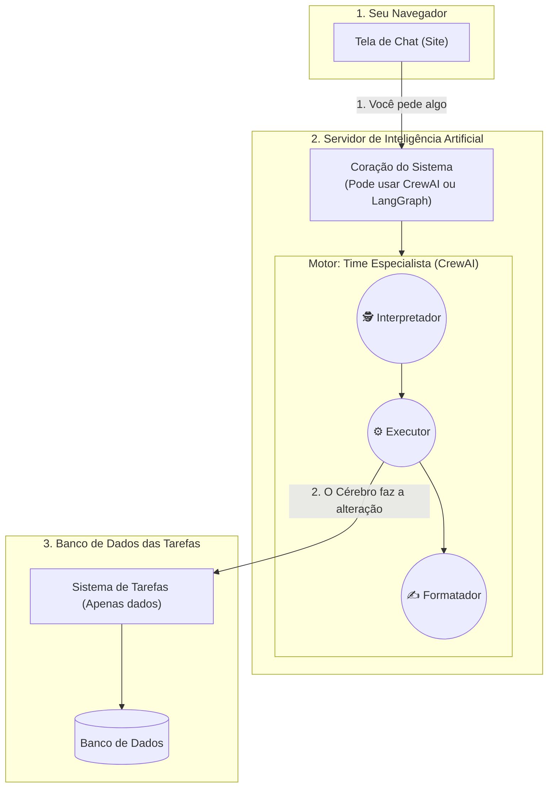

# TaskAgent V2 🤖

> **Bem-vindo(a) ao TaskAgent V2!** Se você nunca ouviu falar de "Orquestração de Agentes", não se preocupe. Este projeto foi desenhado para ser uma vitrine muito clara de como a Inteligência Artificial moderna pode deixar de ser apenas um "chatbot de texto" e passar a **agir no mundo real**.

---

## 📌 O que é o Projeto?

De forma simples: imagine que em vez de clicar em botões para criar ou excluir tarefas no seu computador, você pudesse simplesmente dizer: *"Crie uma tarefa para eu estudar amanhã e delete aquela tarefa número 3"*. 

O **TaskAgent V2** é um assistente virtual que entende o que você fala (como uma pessoa normal), descobre o que precisa ser feito e, sozinho, vai até o seu sistema e faz o trabalho duro para você!

### O Que Torna Isso Especial? (Para Leigos)

Os chatbots comuns (como o ChatGPT na web) apenas *conversam* com você, mas eles não conseguem clicar em botões nos seus aplicativos. O TaskAgent V2 tem **"braços" virtuais** (*Tools* ou Ferramentas) que permitem que ele crie, edite e apague coisas de verdade em um banco de dados.

| O que ele faz | Como ele te ajuda |
|---|---|
| 💬 **Conversa Natural** | Você não precisa decorar comandos difíceis. Fale como falaria com um amigo. |
| 🔀 **Dois "Cérebros"** | Você pode escolher qual tipo de inteligência quer usar (explicamos abaixo). |
| 🛠️ **Ações Reais** | Ele não inventa que fez uma tarefa. Ele realmente vai no sistema e faz a ação. |
| 🧠 **Memória** | Ele lembra do que vocês conversaram antes, facilitando contextos longos. |
| 🎨 **Interface Bonita** | Uma tela de chat escura e moderna para você conversar com ele direto pelo navegador. |

---

## ⚔️ Entendendo os Dois "Cérebros" (Motores de IA)

O grande diferencial tecnológico deste projeto é que ele não usa apenas uma, mas **duas formas diferentes de pensar**. Nós mantemos ambas para que estudantes de tecnologia possam testar e comparar. Se você for instalar o projeto, pode alternar entre elas com um simples "interruptor" no código.

### Motor 1: O Time de Especialistas (CrewAI)

Neste modelo, a Inteligência Artificial funciona como se fosse uma **equipe de funcionários em um escritório**.
Temos três "funcionários" virtuais trabalhando juntos para responder à sua mensagem:
1. **O Interpretador:** Escuta o que você pediu e descobre a sua real intenção.
2. **O Executor:** É quem tem a chave do sistema e vai lá executar o trabalho prático (salvar, apagar).
3. **O Formatador:** Pega o resultado bruto do Executor e escreve uma resposta educada e formatada para você ler.

- **Maior Vantagem:** Muito inteligente, autônomo e lembra do passado (tem memória própria baseada na tecnologia de buscas do Google).
- **Quando o mercado usa:** Quando precisamos de uma IA muito criativa, independente e que lide com pedidos confusos.

---

### Motor 2: O Fluxograma Rigoroso (LangGraph)

Neste modelo, a Inteligência Artificial funciona como um **trabalhador seguindo um manual de instruções muito rigoroso (um fluxograma)**.
Se ela não entender algo, o manual diz: *"pare e pergunte ao usuário"*. Ela não pode improvisar ou tentar "adivinhar", ela só anda pelos caminhos exatos que o programador desenhou.

- **Maior Vantagem:** Muito seguro. O programador sabe exatamente o que a IA vai fazer em cada passo. Não há espaço para ela "inventar" coisas ou errar o caminho.
- **Quando o mercado usa:** Em sistemas bancários ou corporativos sérios, onde a máquina seguir regras restritas é mais importante do que ela ser criativa.

---

## 🏛️ Como as Peças se Encaixam (Arquitetura Simplificada)

Para quem gosta de ver os bastidores, aqui está como o sistema funciona. Abaixo está um diagrama técnico, mas a lógica é simples: 

`1. Você digita no Site` ➔ `2. O Cérebro de IA processa` ➔ `3. A Ação acontece no Banco de Dados`.



---

## 🚀 Como Instalar e Rodar no Seu Computador

Se você quiser testar a "mágica" na prática, siga os passos abaixo.

### Pré-requisitos
- **Python 3.10** ou superior instalado.
- Gerenciador **`uv`** instalado (ou apenas use o `pip` normal do Python).
- **Chave do Google AI Studio** (Para ligar o cérebro CrewAI de forma gratuita).
- **Chave do Groq** (Para ligar o cérebro LangGraph de forma ultrarrápida e gratuita).

### Passo a Passo

**1. Configure suas senhas (chaves)**
Copie o arquivo `.env.example` e renomeie para `.env`. Abra-o e cole suas chaves obtidas nos sites acima:
```env
# Qual cérebro usar? (crewai ou langgraph)
AGENT_ENGINE=crewai

# Suas chaves gratuitas:
GOOGLE_GEMINI_KEY="coloque_sua_chave_gemini_aqui"
GROQ_API_KEY="coloque_sua_chave_groq_aqui"
```

**2. Instale as peças**
Abra seu terminal e digite (se usar o uv):
```bash
uv sync
```

**3. Ligue as Máquinas!**
Você precisará de **dois terminais** abertos ao mesmo tempo, porque o nosso banco de dados e o nosso cérebro de IA rodam separados.

*Terminal 1 — Ligando o Banco de Dados:*
```bash
cd TaskManager
uv run python -m uvicorn main:app --reload
```

*Terminal 2 — Ligando o Cérebro de IA:*
```bash
uv run uvicorn main:app --port 8001 --reload
```

**4. Comece a Conversar!**
Abra o seu navegador (Google Chrome, Edge, etc.) e acesse o endereço: **[http://localhost:8001](http://localhost:8001)**

Exemplos do que você pode pedir para ele:
- *"Quais são minhas tarefas pendentes?"*
- *"Crie uma tarefa para eu estudar Python amanhã."*
- *"Acho que já terminei a tarefa 1, marque como concluída."*
- *"Pode apagar a tarefa 3 pra mim, por favor?"*

---

## 📚 Para Estudantes e Programadores

Se você quer mergulhar a fundo no código e entender como eu construí a lógica técnica disso, recomendo fortemente a leitura destes dois documentos:

- 📓 **[Diário de Aprendizado](docs/LEARNING_DIARY.md)** — Uma jornada passo-a-passo escrita de forma pessoal explicando todos os perrengues, bugs e soluções que encontrei montando esses agentes ao longo dos dias. É uma leitura obrigatória se você quer entender a evolução real do código.
- 📝 **[Arquitetura Detalhada](docs/arquitetura.md)** — Explicação profunda e técnica de como os fluxos (grafos e multiagentes) funcionam por baixo dos panos.

---

*Feito com ❤️ para descomplicar a Inteligência Artificial e torná-la aplicável no mundo real.*
