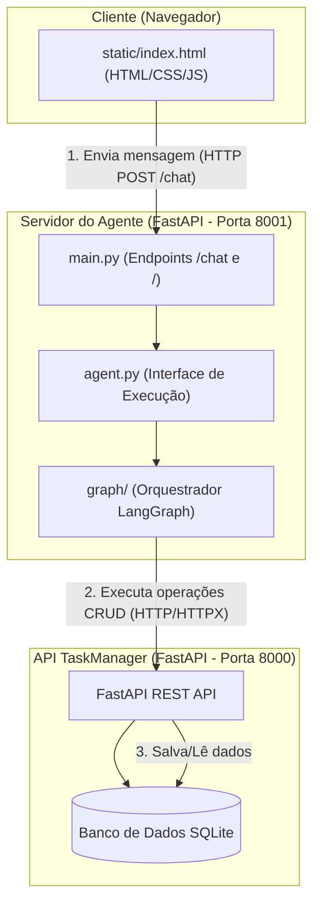
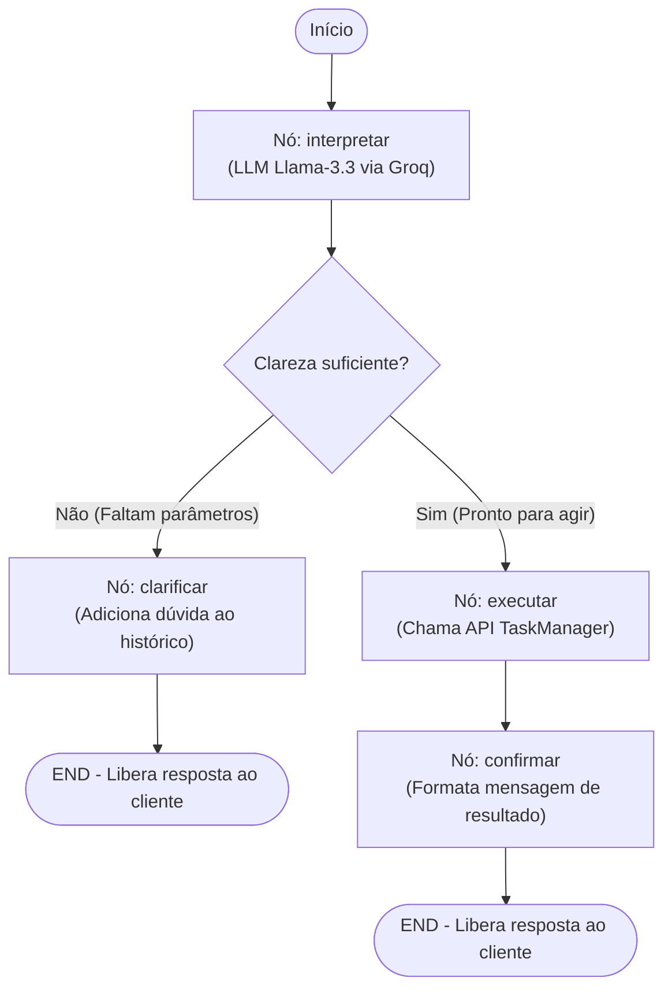

# 🏛️ Minha Arquitetura — TaskAgent V2

Neste documento, eu descrevo a arquitetura completa do **TaskAgent V2**, detalhando a infraestrutura do ecossistema e o funcionamento interno do grafo de estado (`StateGraph`) que construí usando o **LangGraph**.

---

## 🌐 1. Visão Geral do Ecossistema

Para expor o agente de forma amigável no navegador, eu estruturei o sistema em uma arquitetura de múltiplos servidores que se comunicam via HTTP. O fluxo geral consiste em um cliente (frontend), o servidor do agente (que roda o LangGraph) e o servidor de persistência (API TaskManager).

Aqui está o diagrama para representar essa comunicação:

---

## 🔄 2. Fluxo do Grafo de Estado (StateGraph)

O comportamento inteligente do meu agente é governado por um grafo direcionado e cíclico (gerenciado de forma *stateless* a cada requisição). Em vez de travar o servidor web aguardando um input do usuário no terminal, eu projetei as saídas de dúvida para encerrarem a requisição atual (`END`), permitindo que a resposta do usuário seja processada em uma nova requisição utilizando o histórico acumulado como contexto.

Abaixo está o mapeamento visual que criei para o fluxo de execução do grafo:

---

## 🛠️ 3. Detalhamento Técnico dos Componentes

Para tornar o entendimento mais prático, separei os componentes fundamentais que programei no grafo:

### A. O Estado Global (`TaskAgentState`)
Definido em `graph/state.py`, o estado é a única fonte de verdade que viaja entre os nós do meu grafo. Ele é estruturado com os seguintes campos:
*   `mensagem_usuario` (str): A última mensagem recebida do usuário.
*   `historico` (list[str]): O histórico acumulado de diálogos na sessão atual. Ele é crucial para o LLM interpretar respostas de clarificação anteriores.
*   `intencao` (str): A ação que o usuário quer realizar (ex: `criar`, `listar`, `atualizar`, `deletar`).
*   `parametros` (dict): Parâmetros extraídos da mensagem (como `id`, `titulo`, `status`).
*   `clareza` (bool): Flag que indica se temos parâmetros suficientes para prosseguir.
*   `duvida` (str): A pergunta de clarificação formulada caso `clareza` seja `False`.
*   `resposta_api` (Any): O retorno bruto (seja um dicionário ou lista de tarefas) vindo da API do `TaskManager`.
*   `resposta_final` (str): A mensagem de texto final formatada que o usuário lerá no chat.

### B. Os Nós do Grafo (`graph/nodes.py`)
1.  **`interpretar_intencao`**: Envia a mensagem e o histórico de diálogos ao modelo `llama-3.3-70b-versatile` no Groq. O modelo me retorna um JSON estruturado contendo a intenção, os parâmetros extraídos e se há necessidade de clarificar.
2.  **`pedir_clarificacao`**: Se o LLM julgar que faltam parâmetros essenciais (como o título de uma nova tarefa), este nó é acionado. Eu simplesmente guardo a dúvida no estado para o usuário e encerro o grafo.
3.  **`executar_task`**: Traduz a intenção do agente em chamadas HTTP reais direcionadas ao servidor `TaskManager`. É aqui que eu mapeio, por exemplo, nomes em português de status ("concluída") para o formato esperado pelo banco de dados ("done") e faço as requisições `POST`, `GET`, `PUT` ou `DELETE`.
4.  **`confirmar_resultado`**: Analisa a resposta da API do backend e monta um texto amigável de conclusão de sucesso ou erro (ex: listando as tarefas formatadas).

### C. Transições e Roteamento (`graph/graph.py`)
Eu utilizei uma **borda condicional** (`add_conditional_edges`) a partir do nó `interpretar` guiada pela função `deve_clarificar_ou_executar`. Se a chave `clareza` no estado for `True`, o fluxo segue para `executar`; do contrário, ele desvia para `clarificar`.

---

## 📈 4. Benefícios Deste Design
*   **Desacoplamento Completo**: O agente não conhece o banco de dados diretamente; ele se comunica via contratos RESTful. O frontend não sabe como o LangGraph funciona; ele apenas consome um endpoint `/chat`.
*   **Stateless Web Architecture**: A mudança de fluxo de `clarificar --> interpretar` para `clarificar --> END` garantiu que o servidor web FastAPI nunca trave, permitindo que múltiplos usuários interajam de forma isolada sem retenção de threads.
