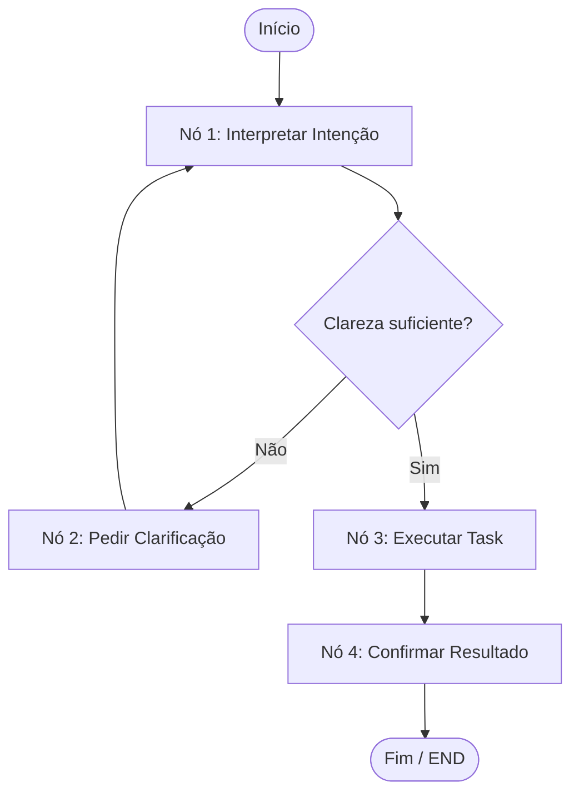

# Arquitetura do TaskAgent V2

Este documento descreve a arquitetura do **TaskAgent V2** e o fluxo de dados do agente estruturado através do LangGraph.

## Fluxo do Grafo (StateGraph)

O fluxo principal do agente é composto por 4 nós lógicos de decisão e execução:

### Detalhamento dos Componentes

1.  **Estado Global (`TaskAgentState`)**:
    Centraliza a memória e dados de transição do agente. Contém entradas, intenção identificada, parâmetros da tarefa, histórico de mensagens e retornos do processamento.
2.  **Nó de Interpretação (`interpretar`)**:
    Analisa a mensagem atual e o histórico para inferir se o usuário deseja `criar`, `listar` ou `deletar` uma tarefa.
3.  **Nó de Clarificação (`clarificar`)**:
    Caso as variáveis da intenção estejam incompletas (ex: falta de ID para deletar, ou falta do título para criar), este nó entra em cena coletando o dado em falta interativamente com o usuário.
4.  **Nó de Execução (`executar`)**:
    Invoca as APIs ou integrações com o sistema gerenciador de tarefas correspondente (atualmente com mocks simulando chamadas HTTP).
5.  **Nó de Confirmação (`confirmar`)**:
    Gera uma resposta formatada final e atualiza o histórico de diálogos da sessão.
